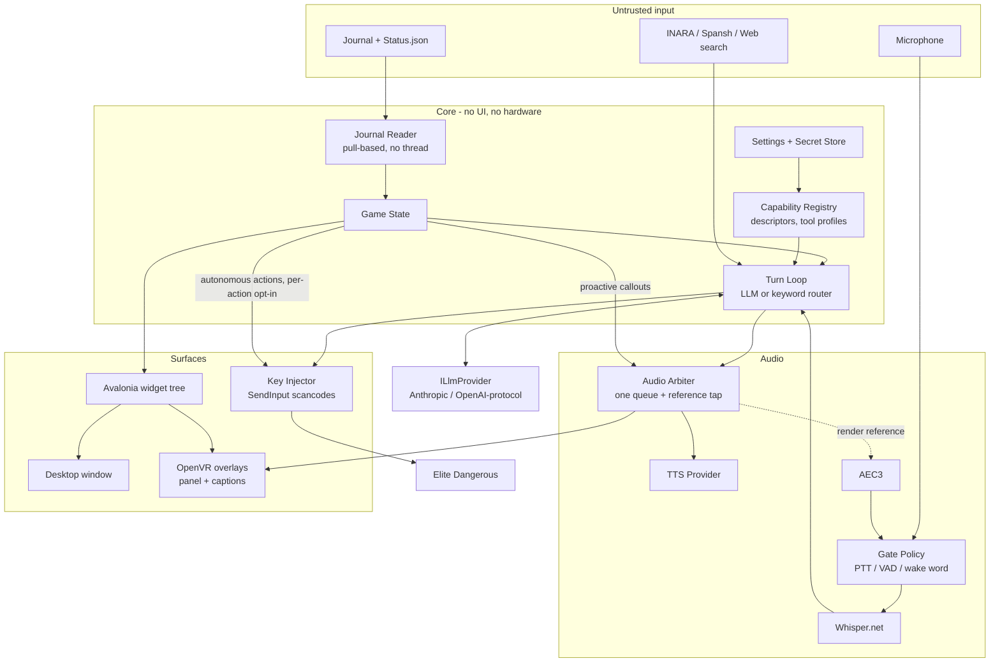

# TheApp — Architecture

Companion to [list.md](list.md). That file is **what** TheApp does; this one is **how** it is built and why those choices were made. Nothing here restates a checklist item — where a decision is forced by one, the item is named.

Target platform is Windows 11 / .NET, C#. Elite Dangerous is the only game integration.

---

## 1. Constraints that drive everything

These come from the checklist, not from taste. Each one eliminates otherwise-reasonable options, so they are stated first.

| Constraint | Source item | What it rules out |
|---|---|---|
| Single statically linked binary, per-user install, no elevation | *TheApp installs on a clean machine* | CEF (~150–200 MB + subprocess model), any kernel driver, anything needing an MSI or admin rights |
| One widget tree renders to both desktop and VR | *TheApp's panel works in VR* | Two UI codebases; a VR surface that is a screenshot of the desktop window |
| Permissive licenses only, no copyleft | Established during Whisper selection | FFmpeg (GPL builds), anything LGPL that resists static linking |
| Every input path answerable with zero capabilities | *Capabilities as state, not guard* | Hard dependencies on the LLM, TTS, or network anywhere on the turn path |
| No telemetry leaves the machine | *TheApp says what went wrong* | Crash reporters, analytics SDKs, hosted logging |
| Testable with no game, headset, or hardware | *Journal behavior is testable without the game* | Any component that owns its own thread or clock |
| Safety-critical rows unreachable by the model | *Protect safety-critical settings from the model* | A single settings-mutation tool the LLM can call |

**The first constraint is the sharpest.** "Single statically linked binary" plus "no copyleft" is what kills the CEF-based HTML overlay outright, and it also constrains what can be done in .NET — see §9.

---

## 2. Stack

| Concern | Choice | License | Rationale |
|---|---|---|---|
| UI framework | **Avalonia** | MIT | The only mature .NET UI toolkit that renders the same visual tree to a window *and* to an offscreen surface. Satisfies "one widget tree" directly. |
| VR compositing | **OpenVR** (`IVROverlay`) via `openvr_api` | BSD-3-Clause | Elite never calls OpenXR; SteamVR overlays composite over any VR app without touching its process. |
| GPU interop | **Vortice.Windows** (D3D11) | MIT | Avalonia offscreen surface → shared D3D11 texture → `SetOverlayTexture`. SharpDX is dead; Silk.NET is the alternative. |
| Speech-to-text | **Whisper.net** + `Whisper.net.Runtime` | MIT (whisper.cpp + ggml MIT) | No FFmpeg anywhere in the graph. |
| Audio capture / render | **NAudio** (WASAPI) | MIT | Mic capture, resampling to 16 kHz mono, and the single output arbiter. |
| Echo cancellation | **WebRTC AEC3** | BSD-3-Clause | Consumes the arbiter's render reference tap. |
| Text-to-speech | Edge Neural (free) / ElevenLabs (paid) | provider terms | Per-role selection; see *ElevenLabs*. |
| LLM | **Anthropic SDK** (`Anthropic` NuGet) + an OpenAI-protocol client, default `claude-opus-5` | MIT (SDK) | Behind an `ILlmProvider` seam — OpenAI and third parties speaking its protocol are first-class; see §6. |
| Logging | **Serilog** | Apache-2.0 | Two sinks: human-readable and structured JSON. |
| Secrets at rest | **DPAPI** (`ProtectedData`) | OS | Per-user, no key management. |

Licenses should be re-verified against the resolved transitive graph at first build — the copyleft problem that motivated the Whisper choice lived in a transitive dependency, not a direct one.

---

## 3. Component map



Dependency direction is one-way: **Core knows nothing about Voice, Surfaces, or providers.** That is what makes the replay harness possible — Core can be driven end to end by a recorded journal with no audio device, no headset, and no model.

Two edges deliberately bypass the model. Journal-triggered callouts (`GS → Arbiter`) fire on the event and never at the model's discretion — an alert that depends on a turn completing is not an alert. Autonomous actions (`GS → Injector`) fire a game input with nobody asking; each is off by default behind its own opt-in, the honk being the first member. The keyword router inside the turn loop is the model-free command path — which is why "no model" still leaves every input answerable.

---

## 4. Process and thread model

One process. Four owners of work:

| Owner | Threading | Notes |
|---|---|---|
| **UI / dispatcher** | Avalonia UI thread | Owns the widget tree. VR texture submission is marshalled here or to a dedicated render thread — never called from arbitrary threads. |
| **Tick loop** | One timer-driven loop, ~4–10 Hz | Polls the journal reader, recomputes game state, fires journal-triggered callouts. |
| **Audio** | WASAPI capture + render callbacks | Real-time constrained. Never blocks on the model, disk, or network. |
| **Turn execution** | `async`/`await` on the thread pool | Model calls, tool execution, TTS synthesis. |

**The journal reader owns no thread and no timer.** It exposes `Poll()` and returns the events read since the last call. The tick loop calls it in production; the replay harness calls it in a tight loop at 100×. This is the single design decision that makes *Journal behavior is testable without the game* achievable rather than aspirational.

File handle: open with `FileShare.ReadWrite | FileShare.Delete` — Elite holds the journal open, and a plain `File.OpenRead` will fail intermittently.

---

## 5. Key decisions

### D1 — Avalonia offscreen, not an embedded browser

**Decision.** Render the Avalonia visual tree to an offscreen surface, copy into a shared D3D11 texture, submit to `IVROverlay`.

**Status: proven end to end.** See [docs/spikes/vr-texture.md](docs/spikes/vr-texture.md) — a live Avalonia panel visible as a SteamVR overlay, measured. The amendments below come out of that spike.

**Why not CEF.** ~150–200 MB and a multi-process model. Incompatible with "a single statically linked binary" and with per-user install without elevation.

**Why not WebView2.** No supported offscreen-to-texture path; the workaround is DirectComposition plus Windows.Graphics.Capture, which needs a live window and reintroduces the desktop-window dependency that *Keep working when the main window is minimized* is trying to remove.

**Why not capture the desktop window.** WGC requires a non-minimized window, which directly contradicts the minimize requirement, and it makes the VR surface a strictly-worse copy of the desktop one rather than a peer.

**"One widget tree" means one *definition*, not one live instance.** A `Visual` belongs to exactly one visual tree, so the desktop window and the VR surface each get their own instantiation of the same view, bound to the same view model. The constraint is still satisfied — there is no second UI codebase, and no path where the VR surface is a screenshot of the desktop one — but the phrase is shorthand and the framework will not do the literal thing.

**Consequence — mini mode.** Mini mode is a `DataTemplate` selection over the same view models, not a second surface. That falls out of the decision rather than needing enforcement.

**Consequence — the copy is a CPU roundtrip, and that is fine.** Avalonia rasterises to a `RenderTargetBitmap`, `CopyPixels` writes straight into a mapped D3D11 staging texture, and `CopyResource` moves it to the shared texture. Zero-copy GPU→GPU is *not* reachable: Avalonia 12 closes `ITopLevelImpl` and the platform render surfaces to external implementation via reference-assembly guards, `RenderTargetBitmap` is a CPU raster surface, and `ICompositionGpuInterop` is import-only. Measured at panel size (1024×640), the whole end-to-end frame costs **0.75 ms live against SteamVR** — of which the Skia rasterise is 0.30 ms and the copy itself is 0.05 ms. At 4–10 Hz that is under 1% of one core, so the roundtrip is a non-issue rather than a compromise, and the fast path is not worth reaching for.

**Consequence — the VR path needs a window, and never shows it.** *Amended in Phase 9; the spike's claim was true of what the spike rendered and false of a real view.* The spike proved a detached `Visual` rasterises correctly, using a hand-built tree of borders and text blocks carrying literal brushes. A real view is neither. A `UserControl` is a **templated** control: its template comes from a control theme, control themes arrive through styling, and styling only runs for an element attached to a logical tree with a root. Detached, the real panel measures to 0x0, materialises **one** visual against 51 hosted, and rasterises as an empty rectangle — no exception, no warning, just a blank quad in the headset. `DynamicResource` fails the same way and for the same reason: the lookup walks the logical tree and there is none, so every themed brush resolves to unset.

So the offscreen surface hosts the view in a `Window` that is **constructed and never shown** (`OffscreenSurface`). It has no desktop presence, no taskbar entry, and nothing the Commander can reach.

Minimise-safety is unaffected, and it is worth being precise about why, because the original wording put the weight in the wrong place. It never really rested on there being no window; it rests on the VR path not depending on the state of the window the Commander *can* see. A window that is never shown has no state to depend on. What the spike genuinely closed stands: there is no capture of a desktop surface anywhere in the chain, and the VR panel is a peer of the window rather than a picture of it.

It also means animations have no clock — anything moving on the VR panel must be driven by the tick loop, which is the intended view-model-driven model anyway.

**Two things to get right in Phase 9**, both from the spike: create the D3D11 device on the adapter SteamVR reports via `IVRSystem.GetDXGIOutputInfo` rather than passing `null` (it happened to resolve correctly on the spike machine, but on a hybrid-graphics machine the default can be the iGPU, and a cross-adapter share will be rejected or slow-pathed); and render only on change, since the panel is view-model-driven and the measured cost is a worst case rather than a target.

### D2 — OpenVR overlays, not OpenXR

Elite renders through OpenVR. `XR_EXTX_overlay` is barely implemented across runtimes. `IVROverlay` composites out-of-process, which is also what keeps TheApp clear of anything resembling game injection.

Two overlay handles, not three. *Amended in Phase 9.*

| Handle | Locking | Input |
|---|---|---|
| Panel | Head- or world-locked, per *VR Panel locking*. `Full` and `Mini` are content modes of it, each with its own placement | Pointer, for grab-to-move |
| Captions | Head-locked, fixed | None — output only |

The original table gave mini its own handle. *TheApp's panel works in VR* is explicit that "Mini is a mode of the same panel — a reduced content set — not a separate surface or a scaled-down copy", and that line is the acceptance criterion, so mini is a mode on the view model and the two modes share one handle and one quad. They do **not** share a size: apparent text size in a headset is the texture's pixel count and the quad's width in metres together, so mini is a smaller image at a smaller width, not the same image hung nearer. Each mode therefore carries its own placement, which is what the "same transform family" row was reaching for.

Captions stay a separate handle precisely so *Overlay Positioning & Look* cannot accidentally apply to them.

**The pointer is the only controller input an overlay gets, and it arrives as mouse events.** This is settled, expensively, by three prior implementations. `IVRSystem.GetControllerState` returns false for controllers that are connected and tracking, silently. An `IVRInput` action manifest was built twice in two separate projects, accepted by SteamVR, reported as bound by `GetActionBindingInfo`, and never went live — `IsInputAvailable` false while `IsSteamVRDrawingControllers` was true. The reason is that an overlay which asks to be pointed at gives up its controllers: SteamVR takes them to drive its own laser, and what comes back is pointer events and nothing else. So:

- `SetOverlayInputMethod(handle, VROverlayInputMethod.Mouse)` and `SetOverlayFlag(handle, MakeOverlaysInteractiveIfVisible, true)`. Without the flag the overlay is a picture and the ray passes through it, silently.
- `SetOverlayMouseScale` in the units the rest of the system uses, re-applied on **every** size change, or the quad reports positions against the size it used to be.
- OpenVR counts mouse Y from the **bottom**; everything else counts from the top. Unflipped, the panel works perfectly upside down.
- Only the trigger. Other buttons arrive through the same channel, so the grip that grabs the panel would otherwise also press whatever the ray was over.
- Pointer and held state must be **latched**: the runtime reports transitions, not state, and a hand held still sends nothing. `VREvent_FocusLeave` clears both, or a Commander who aims away mid-drag never gets the button-up and carries the panel for the rest of the session.
- `trackedDeviceIndex` on an overlay mouse event is **not** the hand — measured as `k_unTrackedDeviceIndexInvalid` against tracked devices 1 and 2. Which hand grabbed is recovered by casting each controller's aim ray at the overlay and taking the nearest hit.

**Grabbing is one frozen offset.** `offset = hand⁻¹ · overlay` at the press, `overlay = hand · offset` every frame after, always measured from the grab origin rather than accumulated from the last answer — accumulating makes the overlay's speed a function of how often it is asked, which reads as broken tracking rather than as wrong arithmetic. Nothing re-faces the panel at the Commander while it is held: a panel forced upright and square cannot be tilted to read from below, which is most of what moving one is for.

**Conventions, each of which is invisible until it is not.** `HmdMatrix34_t` is column-vector where `System.Numerics.Matrix4x4` is row-vector, so the rotation transposes on the crossing — and the error is invisible for any placement square to the view, so the test that matters rotates on all three axes. An overlay quad faces its own **+Z**; a controller and the head face **-Z**. A tracked pose is only real if `bPoseIsValid` **and** `bDeviceIsConnected`: an all-zero device slot converts to a perfectly valid-looking unit quaternion at the origin, so an unchecked slot is a grabbed panel dragged to the Commander's feet the moment a controller sleeps. Quaternions out of a tracking runtime drift off unit length over a session and are normalised at the boundary.

**Lifecycle, beyond what the state machine already says.** `VR_Init` is called once per process and nothing in OpenVR refuses a second call, so the refusal lives in our code. `EVROverlayError.KeyInUse` means another copy of d47 owns the key, not a generic failure, so overlay keys are claimed before anything expensive is built. Recovery from a mid-session SteamVR restart rebuilds every handle rather than repairing any — the first refused call unwinds, the session is dropped, and the next poll starts clean. `ClearOverlayTexture` precedes `DestroyOverlay`, because an overlay outliving the device that owns its image leaves SteamVR querying a destroyed one.

**Lifecycle.** SteamVR may start after TheApp, exit under it, or restart mid-session. The overlay subsystem is a state machine (`Unavailable → Connecting → Active`) polled from the tick loop, and every handle is re-created on reconnect. *Order agnostic Overlay* is this state machine; there is no initialization ordering to get right.

**The readiness signal is `VR_Init` succeeding, not SteamVR running.** The spike hit `VR_Init` returning `Init_HmdNotFound` while `vrserver.exe` was already up: "SteamVR is running" and "an HMD is present and usable" are different conditions, and the process is not evidence of the second. The state machine must therefore poll `VR_Init` and treat its return code as the transition, never a process check — otherwise `Connecting` latches on a machine that will never produce a headset.

**The binding is vendored, not packaged.** There is no canonical Valve NuGet package for OpenVR. Valve's official `openvr_api.cs` is BSD-3 and is vendored in-tree; a stale third-party binding fails as an `FnTable` vtable mismatch — wrong function called, no error — rather than as anything diagnosable. The spike's copy under `spike/` is the one to promote.

**Re-anchor.** Elite's recenter is invisible to SteamVR. Re-anchor reads `GetDeviceToAbsoluteTrackingPose` for the HMD, computes the delta against the stored anchor, and applies it to every world-locked handle as a group so relative layout survives.

### D3 — Whisper.net + NAudio, no media framework

`WasapiCapture` → float PCM → `MediaFoundationResampler` to 16 kHz mono → `Whisper.net`. Live mic means no container to demux and no codec to decode, so FFmpeg has no reason to exist in the graph.

GPU is opt-in and defaults off when a headset is present — see *STT Model Choice*. The runtime package (`Whisper.net.Runtime` vs `.Cuda`) is selected at load time, not compile time, so the toggle does not require a reinstall.

### D4 — Key injection: scancodes, no driver, no hook

`SendInput` with `KEYEVENTF_SCANCODE`. Three rules, all load-bearing:

1. **Never install a low-level keyboard hook.** A `WH_KEYBOARD_LL` hook is a global input chokepoint; a stall in TheApp becomes a stall in the Commander's controls.
2. **`release_all()` is unconditional** — `try/finally`, plus on app exit and on focus loss. A stranded key here is a throttle that will not stop.
3. **Verify Elite is foreground before injecting.** `GetForegroundWindow` against the cached Elite HWND. A voice command must never type into a browser.

Virtual joystick drivers (vJoy, ViGEmBus) were considered and rejected: a kernel driver contradicts "per-user install, no elevation" and is a support burden disproportionate to the benefit.

**Two deliberate widenings of “scancodes only”, added in Phase 10, each with its reason. Neither touches the three rules above.**

1. **Mouse buttons go through the same `SendInput` call.** Elite’s own default keyboard preset, `KeyboardMouseOnly`, binds `PrimaryFire` to `Mouse_1` and `SecondaryFire` to `Mouse_2` — and the discovery scanner has no binding of its own, because it fires as a fire-group weapon. A keyboard-only injector therefore cannot honk on the setup most Commanders start with, which would make *TheApp honks when you arrive in a system* ship inert on a default install. Buttons are subject to the same foreground check and the same unconditional `release_all()`.
2. **Chat text uses `KEYEVENTF_UNICODE`.** A scancode is a physical key position, and the character it produces depends on the Commander’s keyboard layout: sending a system name by scancode types something else entirely on AZERTY. Unicode injection is layout-independent and Elite’s chat field accepts it. This applies to *text* only — every binding, action and macro step still goes as a scancode, because that is what DirectInput reads.

Binds are **read-only**. The parser produces a map of action → device + key, which feeds both *Know which actions the Commander can actually reach* and *Report a key that is bound twice*. TheApp never writes the Commander's bindings.

**Resolving which file to read is the part that is easy to get wrong.** There are three traps, and the naive version of this walks into all of them:

1. **The active preset is named in `StartPreset.<major>.start`, not assumed.** On the development machine that file reads `KeyboardMouseOnly` — a preset shipped with the game, not a custom one. Reading `Custom.*.binds` unconditionally would parse a file the Commander is not using and confidently report the wrong keys.
2. **A built-in preset does not live in the user profile.** `%LOCALAPPDATA%\Frontier Developments\Elite Dangerous\Options\Bindings\` holds custom presets; the shipped ones live under the game's install directory. Both paths have to be searched.
3. **The version suffix moves.** The custom file on that machine is `Custom.4.2.binds` while the start-preset file is still `StartPreset.4.start`, so the two numbers are not the same number and neither may be hardcoded. Match by pattern and take the highest version present.

A Commander who has never customised their binds is the common case, not an edge case, and it is exactly the case a hardcoded `Custom.4.0.binds` fails on — silently, by finding nothing or by finding a stale file, and then advertising an action set that does not match the keyboard in front of them.

### D5 — Capability registry as the single source

One `CapabilityDescriptor` per capability, registered once at startup and never mutated. It declares: identity, tool schemas, help text, settings rows, display model, and documentation page slug.

Five things are **projections** of the registry rather than parallel structures:

- Tool schemas sent to the model
- Settings rows rendered in the UI
- Spoken help (*Answer what can you do, from the registry*)
- The keyword router's vocabulary
- The docs CI gate (*Every capability has a documentation page*)

Immutability is not stylistic. It is what makes tool schemas byte-identical across turns, which is what makes prompt caching work — see §6.

### D6 — Two stores, atomic writes, DPAPI

Settings and secrets are separate stores because one loader cannot both fail loudly and shrug: a corrupt settings file should surface as an error, a missing secret should surface as a capability being off.

Writes go to a `.writing` sibling then `File.Move` with overwrite — atomic on NTFS. Secrets are DPAPI-encrypted with `DataProtectionScope.CurrentUser` — which is why the install is per-user. The single writable folder beside the executable is the checklist's portability decision; DPAPI works wherever the file lives.

### D7 — One audio arbiter

A single priority queue in front of WASAPI render. Every audible thing — speech, cues, thinking bed, music, ambience — enters through it. Ducking, interruption, supersede, and caption timing are all properties of the queue rather than separate mechanisms.

The arbiter exposes a **render reference tap** from day one: a copy of the mixed output buffer, timestamp-aligned, for AEC3 to subtract from capture. Retrofitting this later means opening the one component every voice path depends on.

`Shut up` is a queue operation (flush + stop current), not a feature layered on top. That is why it can be instant.

---

## 6. LLM integration

The turn loop talks to an **`ILlmProvider` seam**, never to a vendor SDK directly. Two implementations ship: **Anthropic** (the `Anthropic` NuGet) and **OpenAI-protocol** — which covers OpenAI itself and every third party speaking its API (OpenRouter, Ollama, LM Studio, vLLM). The seam owns tool-schema translation (Anthropic `input_schema` vs OpenAI `parameters`) and reports what the active endpoint supports into *Capabilities as state*, so a feature the provider lacks is a capability that is off rather than a failure to handle. Changing the endpoint resets the model list to that endpoint's namespace (*Show the controls the active provider actually has*).

Default: Anthropic, `claude-opus-5`, adaptive thinking. Effort is chosen **per turn**, not per install — *Model Level and Thinking* has the router gauging low through max, never "off" unless the LLM itself is set to none.

The response is **streamed**: the checklist's largest perceived-latency win — *"synthesis is sentence-chunked so speaking starts at the first sentence boundary"* — only exists if sentences leave the model before the completion finishes.

```csharp
using Anthropic;
using Anthropic.Models.Messages;

var parameters = new MessageCreateParams
{
    Model = "claude-opus-5",
    MaxTokens = 8192,
    Thinking = new ThinkingConfigAdaptive(),
    OutputConfig = new OutputConfig { Effort = effortForThisTurn },
    System = new List<TextBlockParam>
    {
        new() { Text = personaAndGuardrails,
                CacheControl = new CacheControlEphemeral() },
    },
    Tools = profile.Tools,
    Messages = history,
};

await foreach (RawMessageStreamEvent ev in client.Messages.CreateStreaming(parameters))
{
    if (ev.TryPickContentBlockDelta(out var delta) &&
        delta.Delta.TryPickText(out var text))
    {
        // Completed sentences are enqueued on the audio arbiter as they close,
        // so speech starts at the first sentence boundary, not at end of turn.
        sentenceSplitter.Push(text.Text);
    }
}
```

The caching mechanics below are Anthropic-specific; the **ordering discipline is not**. OpenAI-protocol endpoints cache automatically on a prefix match with no breakpoints to place, so the same assemble-by-volatility order is what earns their cache hits too. Assembly is provider-neutral; only breakpoint placement lives behind the seam.

### Prompt assembly order

The API renders `tools` → `system` → `messages`, and caching is a **prefix match**: any byte change invalidates everything after it. Assembly is therefore ordered strictly by volatility.

| Position | Content | Volatility |
|---|---|---|
| 1 | Tool profile schemas | Per mode, from a closed set |
| 2 | Anti-invention guardrails | Never |
| 3 | Persona block | Per persona selection |
| 4 | Commander's About Me | Per session |
| 5 | ← **cache breakpoint** | |
| 6 | Conversation history | Per turn |
| 7 | Live game state | Per turn |

**Guardrails sit above the persona**, which is what makes *Personality on/off* safe: switching the persona off truncates block 3 and invalidates from there down, but the guardrails are in the cached region and are structurally unremovable by any setting.

### Tool profiles and the caching conflict

Tool definitions serialize first, so a per-turn change to the tool set invalidates the *entire* prefix — not a tail of it. Mode-gated advertisement and budget-gated selection both want to mutate the tool set per turn. The resolution in *Offer only the actions that work right now* is to quantize: a closed enumeration of profiles (on-foot / SRV / supercruise / normal-space / no-game), each byte-identical every time it ships. Four or five cache entries, each warm for as long as the Commander stays in that mode.

There is now a first-class alternative worth evaluating: **mid-conversation tool changes** (beta `mid-conversation-tool-changes-2026-07-01`, Claude Opus 5 onward). Tools are declared up front with `defer_loading: true` and surfaced later via `tool_addition` / `tool_removal` blocks on a `{"role": "system"}` message — the tool set changes without invalidating the cached prefix. If the C# SDK exposes these block types, it collapses the profile enumeration into a single warm prefix and removes the mode-transition cache miss entirely. **Verify SDK support before designing around it** — typings for these blocks lag the API in several SDKs.

### Live game state without invalidation

Game state changes every turn and must not sit in the cached region. Two options, in preference order:

1. **A `{"role": "system"}` message appended to `messages[]`.** Preserves the cached prefix, and carries operator authority rather than arriving as user text — which matters because journal content is untrusted (§7). Model-gated: supported on Claude Opus 5 and Opus 4.8, **not** on Sonnet 5, and varying across OpenAI-protocol endpoints — so it slots naturally into *Capabilities as state*: where the active provider lacks it, the capability is off and path 2 is used.
2. **A `<system-reminder>` text block in the user turn** — same caching profile, weaker trust signal. This is the fallback path.

### The 20-block lookback

Each cache breakpoint walks back at most **20 content blocks** looking for a prior entry. An agentic turn that fires several tools produces a `tool_use` + `tool_result` pair each, and a multi-tool turn can blow past 20 blocks in one exchange — after which the next turn's breakpoint silently finds nothing and the whole prefix is re-billed.

Mitigation: place an intermediate breakpoint roughly every 15 blocks during long tool sequences. The budget is 4 breakpoints per request, so this competes with the system-prompt breakpoint — spend them deliberately.

### Other invalidators to design around

- **Switching model or provider invalidates everything** (caches are model-scoped). A Commander changing providers mid-session pays a cold prefix; that is expected and should not be reported as a regression.
- **Minimum cacheable prefix is model-dependent** — 512 tokens on Claude Opus 5, 1024 on Opus 4.8 and Sonnet 5, higher on older models. A short system prompt silently will not cache: no error, just `CacheCreationInputTokens: 0`.

  **Measured 2026-08-12, and currently biting.** A first live turn on `claude-opus-5` reported 472
  input tokens with `CacheCreationInputTokens: 0` — the cached region is the ~409-token guardrails
  block alone, because position 1 (tool schemas) is empty and position 3 (persona) is null until
  Phases 10 and 11. Nothing caches yet, exactly as this bullet warns, and the cost arithmetic
  confirms it independently: the turn priced at plain input rates rather than the 1.25x cache-write
  rate. The prefix crosses 512 on its own once tools are advertised and a persona block is present,
  so the fix is those phases arriving rather than anything here. Padding the prompt to reach the
  threshold would be inventing prompt content to satisfy a metric.

  **It is the cached region that must clear the minimum, not the request.** A later turn in the same
  session reported 1020 input tokens and still cached nothing, because conversation history sits
  *below* the breakpoint — it can grow without bound and will never make a short system block
  cacheable. Watching total input as the signal is the easy mistake here, and it reads as "caching
  is broken" when the truth is "there is not yet enough above the breakpoint to cache".
- **Non-deterministic serialization** of tool schemas (unordered dictionaries) breaks byte-identity. Serialize with a stable key order.

`LLM Turn Price` reads `response.Usage.CacheReadInputTokens` and `CacheCreationInputTokens`; on the OpenAI protocol the analogous signal is `usage.prompt_tokens_details.cached_tokens`. The price table is per provider and per model, so the running total survives an endpoint switch. A cold prefix with no accompanying profile switch is the regression signal.

---

## 7. Trust boundaries

TheApp feeds the model text it did not author. Enumerated:

| Source | Attacker | Reaches the model as |
|---|---|---|
| Journal / Status.json | Another Commander's chosen name, ship name, or in-game message | Game state, situational awareness |
| In-game comms | Any player in range | Re-voiced message content |
| Web search results | Anyone on the internet | Tool result |
| INARA / Spansh | Third-party service | Tool result |

**Consequence:** anything the model can call, a hostile in-game message can attempt to invoke. This is why *Protect safety-critical settings from the model* is a caller property, not a modality property — the protected set is unreachable from the tool surface entirely, and reachable from the panel, a hotkey, and the model-free keyword router.

Guardrails are static prompt material in the cached region. They cannot be stripped by a budget setting, an effort setting, or a persona change, because none of those touch that block.

Egress is enumerated per provider and disclosed — see *Say what each provider receives*. Local-only operation (keyword router, **voice provider set to none**, no INARA key, no web search) is a reachable configuration, and the logging subsystem sends nothing regardless.

> **Amended in Phase 11.** This sentence used to list *Edge TTS* as part of local-only operation. It is not: Edge Neural is `speech.platform.bing.com`, and every line d47 speaks is sent there to be turned into audio. The free provider is free, not local. The correction matters because the disclosure had no text-to-speech entry at all until Phase 11 added the second provider — so d47 could truthfully render "nothing is leaving this machine" while shipping every spoken word to Microsoft. `EgressDisclosure.TextToSpeech` is now part of the enumerated set, and the only silent configuration is the voice provider set to none.

---

## 8. Testability

| Surface | Substitute | What it proves |
|---|---|---|
| Journal | Recorded fixtures, replayed at 1× and 100× | State derivation, callout triggering, milestone priming |
| Model | Keyword router; canned responses | Every input path answerable with no LLM |
| TTS | Null sink recording queue operations | Ducking, supersede, interruption ordering |
| Microphone | WAV file into the gate | Gate policy transitions without hardware |
| SteamVR | `Unavailable` state | Order-agnostic startup |
| Elite window | Injector in dry-run mode | Key sequences asserted, nothing sent |

Fixtures are byte-preserved via `.gitattributes` (`*.log -text -diff`) and scrubbed of the Commander name and real system visits — the repository is public.

The property that makes all of this work is that no Core component owns a thread or reads the clock directly. Time is injected.

---

## 9. Packaging: the honest version

*TheApp installs on a clean machine* asks for "a single statically linked binary." In .NET that phrase does not have a clean referent, and it is worth naming the gap now rather than discovering it at 0.1.0.

| Approach | Result | Cost |
|---|---|---|
| **Single-file publish** + `IncludeNativeLibrariesForSelfExtract` | One `.exe`; native DLLs extract to a temp dir at first run | Not actually static. Extraction is visible to AV heuristics, and an unsigned binary doing it is a plausible SmartScreen trigger. |
| **NativeAOT** | Genuinely ahead-of-time compiled | Avalonia supports it. Whisper.net and `openvr_api` are native P/Invoke targets that still need to ship alongside or be statically linked — neither is turnkey. Reflection-based serialization must be replaced with source generators. |
| **Framework-dependent** | Small download | Requires a .NET runtime on the machine. Contradicts "clean machine." |

Recommendation: **self-contained single-file publish, unsigned, with a published SHA-256**, and treat "statically linked" in the checklist as shorthand for "one file the Commander downloads and runs, no runtime prerequisite, no elevation." NativeAOT is worth revisiting once the native dependency set is stable, but making it a 0.1.0 blocker would trade a shipping date for a property no user can observe.

Two things that *are* observable and should not be traded away: no elevation, and no runtime prerequisite.

---

## 10. Rejected alternatives

| Rejected | In favour of | Reason |
|---|---|---|
| CEF / HTML-to-texture | Avalonia offscreen | 150–200 MB; multi-process; kills single-binary |
| WebView2 + WGC | Avalonia offscreen | No offscreen texture path; needs a live window |
| Desktop-window capture (OVR Toolkit style) | Native overlay | Contradicts minimize requirement; VR becomes a worse copy of desktop |
| OpenXR overlay extension | OpenVR `IVROverlay` | Elite doesn't call OpenXR; extension poorly supported |
| FFmpeg (any wrapper) | NAudio | GPL builds; unnecessary for live mic |
| Cloud STT | Whisper.net local | Network dependency on the core input path; egress of every utterance |
| vJoy / ViGEmBus | `SendInput` scancodes | Kernel driver vs. per-user no-elevation install |
| `WH_KEYBOARD_LL` hook | Foreground check + `SendInput` | Global input chokepoint; a stall becomes the Commander's stall |
| Writing the Commander's binds file | Read-only parse + guidance | ED caches binds; format is version-sensitive; silently rewriting a HOTAS config is unforgivable |
| Per-turn dynamic tool selection | Closed profile enumeration | Destroys prompt caching on the exact turn caching starts to matter |
| Separate audio path per voice | One arbiter | Separate paths per voice are how a line gets spoken in the wrong one |

---

## Open questions

1. **Mid-conversation tool changes in the C# SDK** — if supported, it removes the mode-transition cache miss on the Anthropic path. It is Opus-5-onward and Anthropic-only, so the profile enumeration stays regardless: it is the portable design every provider gets, and the beta is an optimization on one of them.
2. **Overlay transparency, in the compositor.** *Narrowed in Phase 9, not closed.* The caption layer is transparent everywhere its box is not, and it is asserted to be — an opaque rectangle across the Commander's view is the failure that would matter, and a headless test reads the alpha channel and refuses it. What is still unanswered is what the **compositor** does with it: `IVROverlay` expects premultiplied alpha, `RenderTargetBitmap`'s locked framebuffer reports `Premul`, and nobody has looked at the result in a headset. A previous implementation ran a partly transparent overlay successfully without ever pinning down which convention it was relying on, which is encouraging and is not evidence. Everything else d47 draws is opaque, so this is confined to captions.

3. **Two concurrent overlay handles.** *Narrowed in Phase 9.* Panel and captions, sharing one D3D11 device — and sharing it is not a saving but a requirement: a previous implementation gave each surface its own graphics device and it ran perfectly until the first moment two of them submitted in the same session, then took the runtime down from inside `vrclient` with an access violation. OpenVR keeps its graphics state per process rather than per texture. Two handles is code-complete and unmeasured; the 0.75 ms figure still covers one.

4. **Whether any of the headset path works in a headset.** Phase 9 is written, tested headlessly and merged, and nothing in it has been seen through a lens. The tiers are deliberate — the state machine, the placement arithmetic, the caption rules and the matrix conventions are all asserted with no hardware, and what is left on the far side of `IVrRuntime` is interop that no test can reach. What that leaves unanswered is everything a face answers: whether the panel is legible at 1.1 m, whether the placement defaults read well, whether grabbing feels attached, whether captions survive a starfield. SteamVR's `driver_null` would let the texture handoff and the transform round-trip be asserted against a real compositor with no headset attached, which is the largest piece of this that could stop needing a person.

5. **The model cannot call a tool yet, and Phase 10 is what makes that expensive.** *Found in Phase 10.* Nothing in the turn loop parses a `tool_use` block, runs it and appends a `tool_result`, and no provider sends tool definitions at all — so all thirty-odd registered tools are reachable only through the model-free routes: the keyword router, and the declared command phrases Phase 10 added. That was a defensible gap while the tools were all *reporting* tools, and it stops being one now that four of them fly the ship: "gear down" works because a phrase was written down for it, and anything phrased differently reaches nothing. The half of this that Phase 10 owns is done and tested — `ToolProfiles` decides which tools would ship, quantized by mode so the prefix stays warm — and it is gated behind `LlmProviderCapabilities.SupportsToolCalls`, which is false everywhere, because advertising a tool the loop would silently drop is worse than not offering it: the model then tells the Commander it has done something that never happened. What is left is the agentic half, plus the 20-block breakpoint handling above that a multi-tool turn immediately runs into.

**Resolved.** *Avalonia → D3D11 shared texture* was the highest-risk unknown in the stack and is now proven end to end — see D1 and [docs/spikes/vr-texture.md](docs/spikes/vr-texture.md). *Keep working when the main window is minimized* falls out of the same result with one correction Phase 9 had to make: there is a window in the VR path, because a templated control needs a logical root to be styled at all, and it is never shown. Minimise-safety does not rest on there being no window; it rests on the VR path not depending on the state of the window the Commander can see. See D1.
