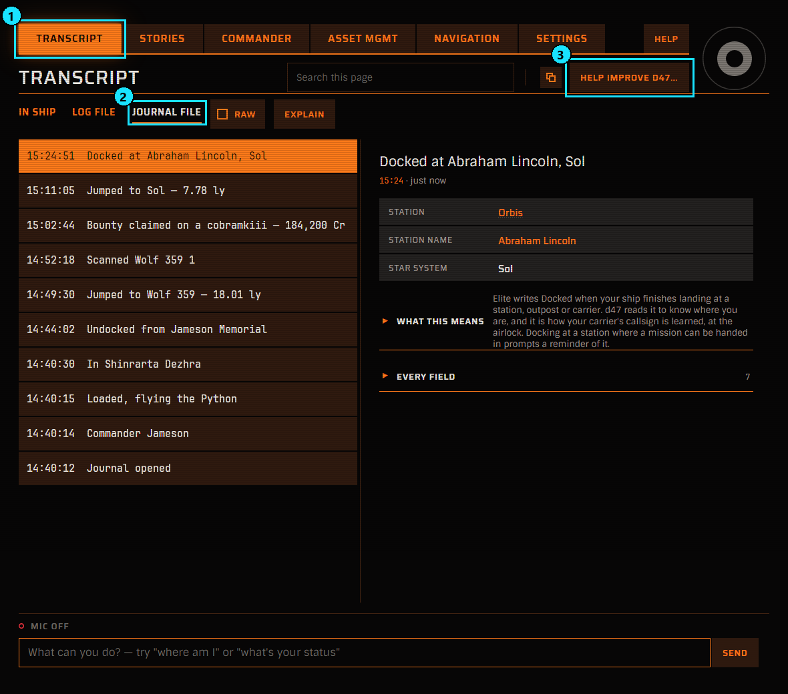
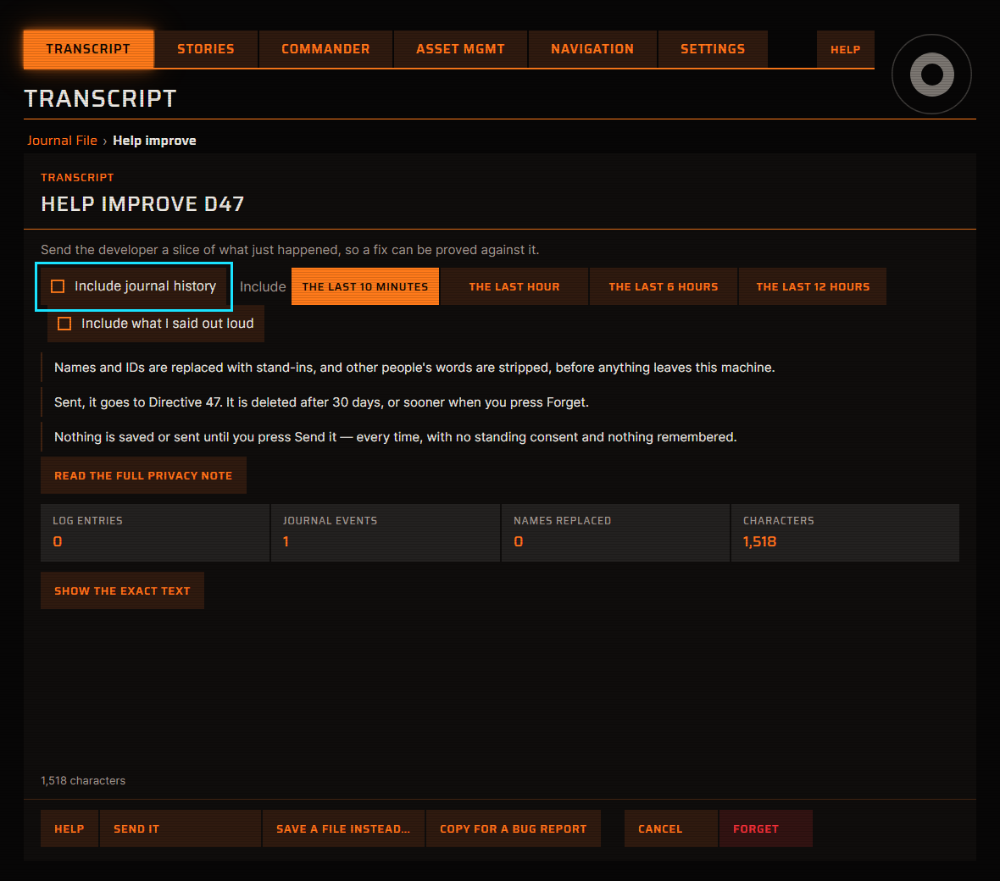
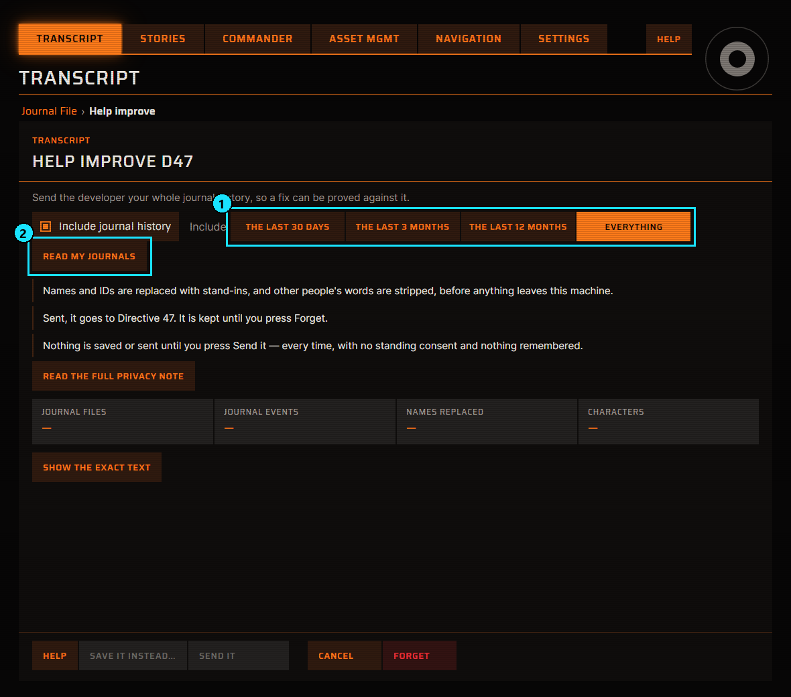
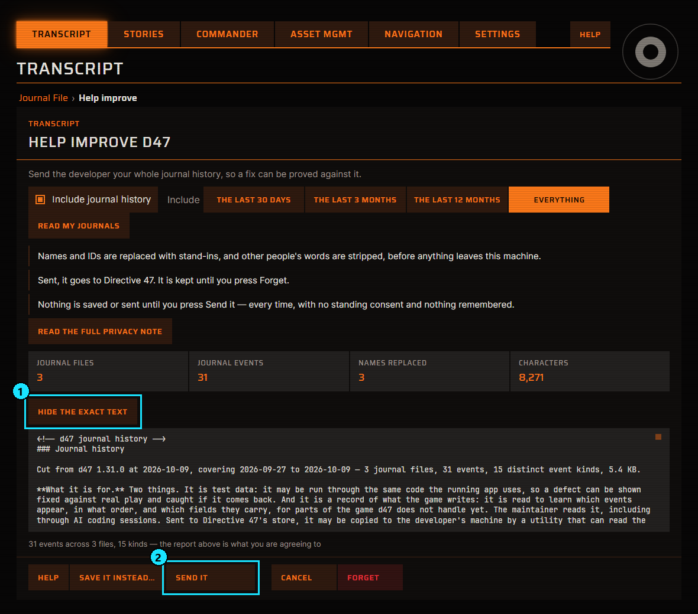
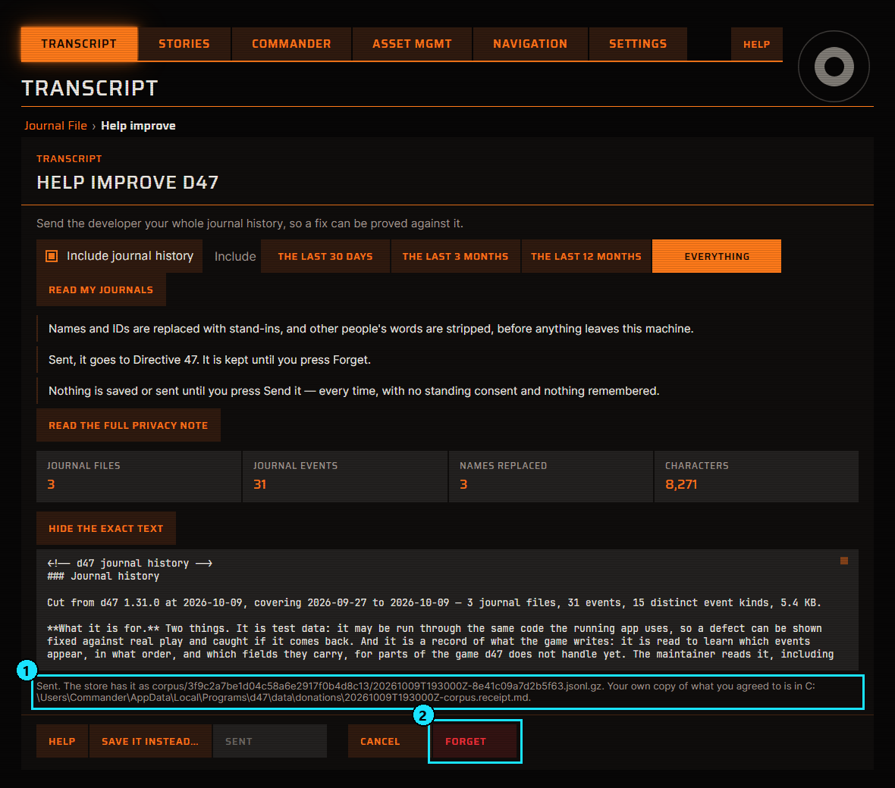

<!--
  The screenshots are rendered by TheJournalHistoryIsDonatedInFiveSteps in D47.App.Tests and boxed
  by tools/donate-walkthrough.py, which writes them to assets/donate-journals/. Re-run both when
  the Help improve page or the panel's bar changes. The numbers in each list match the numbered
  boxes in the picture under it.
-->

How to send your Elite journal history to Directive 47 from inside the app. Nothing leaves your
machine until you press **SEND IT** in step 4.

Your journals help find bugs that nobody has reported yet. Your Commander name and IDs are replaced
with stand-ins and other players' messages are removed before you see anything. The
[donation privacy notice](donation-privacy.html) says who holds it and how to have it deleted.

## 1. Open Help improve D47

1. Select the **TRANSCRIPT** tab.
2. Select **JOURNAL FILE**.
3. Press **HELP IMPROVE D47…** at the top right.

The same button is on **LOG FILE** and opens the same page.

## 2. Tick Include journal history

The page opens on a short excerpt of the last few minutes. Ticking **Include journal history**
switches it to your journal history.

Reporting one thing that just went wrong? Leave the box unticked and press **SEND IT** on this page.
That sends only the excerpt, which is deleted after 30 days.

## 3. Choose Everything, then read your journals

1. Under **Include**, choose **EVERYTHING**. The whole history gives the most to test against.
   **THE LAST 30 DAYS**, **THE LAST 3 MONTHS** and **THE LAST 12 MONTHS** are there if you would
   rather send less.
2. Press **READ MY JOURNALS**.

Reading happens on your machine and sends nothing. A long history takes a few seconds, and the line
above the buttons counts the files as it goes.

## 4. Check what will be sent, then send it

1. Press **SHOW THE EXACT TEXT** to read the report. The button then reads **HIDE THE EXACT TEXT**.
   The report lists every kind of event included, with one real scrubbed line of each.
2. Press **SEND IT**.

Rather not send it over the network? **SAVE IT INSTEAD…** writes the scrubbed history to a file, and
what you do with that file is up to you.

## 5. Done

1. The line above the buttons starts with **Sent** and says where your own copy of what you agreed
   to is saved.
2. **FORGET** deletes everything this installation has sent, whenever you want. A journal history is
   kept until you press it.

## More about this

- [Help improve D47](help-improve.html): what the scrub keeps and why a history is shown as a report.
- [Donation privacy notice](donation-privacy.html): who holds it, for how long, and how to have it deleted.
