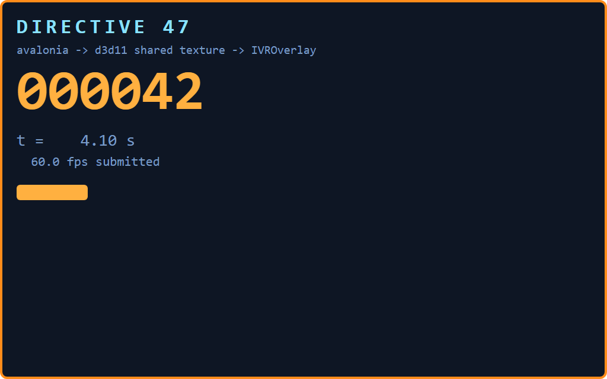

# Spike: Avalonia → D3D11 shared texture → `IVROverlay`

Answers **Open question #1** in [architecture.md](../../architecture.md), the highest-risk
unknown behind **D1** (Avalonia offscreen, not an embedded browser).

Spike code lives in [`spike/OverlaySpike`](../../spike/OverlaySpike). It is deliberately
**not** in the solution — it is throwaway.

---

## Verdict

**D1 holds. The fast path is closed; the slow path is free at our refresh rate.**

| Link in the chain | Result |
|---|---|
| Avalonia renders a full visual tree with **no window, no HWND, no desktop presence** | ✅ proven |
| That surface reaches a **shared D3D11 texture** (`MiscFlags.Shared`) | ✅ proven |
| `IVROverlay.SetOverlayTexture` accepts it, live-updating, against a real HMD | ✅ proven — 415 frames, zero errors, `IsOverlayVisible=True` throughout |
| A human confirming the counter ticks **inside the headset** | ✅ confirmed — correct orientation and colour, no flip needed |
| Zero-copy GPU→GPU (Avalonia renders *directly into* the D3D11 texture) | ❌ **closed by Avalonia 12's public API**, see [The fast path](#the-fast-path-is-closed-deliberately) |
| CPU roundtrip cost at panel size | ✅ measured: **0.41 ms/frame**, ~0.4 % of one core at 10 Hz |

The question behind the question — *is a CPU roundtrip acceptable?* — is answered
emphatically. At the D47 panel size and 4–10 Hz, the entire render-and-upload chain costs
**less than half a percent of one core**. The zero-copy path would be optimising something
that is already three orders of magnitude below the frame budget.

**Recommendation: keep D1, implement the CPU path, do not pursue GPU texture sharing.**

---

## Environment

| | |
|---|---|
| OS | Windows 11, `10.0.26200` |
| .NET SDK | 10.0.302 |
| Avalonia | 12.1.1 |
| Vortice.Windows | 3.8.3 (`Vortice.Direct3D11`, `Vortice.DXGI`) |
| OpenVR bindings | Valve's official `openvr_api.cs`, BSD-3-Clause, `IVROverlay_028` |
| SteamVR runtime | `openvr_api.dll` 1.1.1, from the Steam install |
| CPU | Intel Core Ultra 9 285K |
| GPU | NVIDIA GeForce RTX 5080 (DXGI adapter 0; Intel iGPU also present) |
| HMD | streamed, over the machine's existing Virtual Desktop setup |

Licences are clean: OpenVR BSD-3, Vortice MIT, Avalonia MIT. Nothing copyleft entered the
graph.

---

## What actually works

### 1. Offscreen render with no window

This is the load-bearing discovery, and it also settles **Open question #3**
(*Keep working when the main window is minimized*). A `Visual` that has never been in a
window, never been shown, and has no `TopLevel` renders correctly — text, fonts, layout,
rounded borders and all:

```csharp
var panel = new PanelView(1024, 640);          // a plain Border/StackPanel tree
panel.Measure(new Size(w, h));
panel.Arrange(new Rect(0, 0, w, h));

using var rtb = new RenderTargetBitmap(new PixelSize(w, h));
rtb.Render(panel);                              // no TopLevel involved
```

Output of `OverlaySpike.exe snap` — a real widget tree, rendered by a process that never
created a window:



There is no VR rendering path that assumes a visible surface, because there is no window
in the chain at all. Minimise-safety is free.

**Caveat worth recording now:** a `Visual` belongs to exactly one tree. "One widget tree
renders to both desktop and VR" means *one `DataTemplate`/view definition bound to one view
model, instantiated twice* — not one live control instance rendered to two targets. That
still satisfies the constraint (there is no second UI codebase, and mini mode remains a
template selection), but it is a different thing from what the phrase literally says.

Animations are also not free here: with no `TopLevel` there is no clock driving
transitions, so anything moving must be driven by the tick loop. For D47 that is the
intended model anyway — the panel is view-model-driven at 4–10 Hz.

### 2. Shared D3D11 texture

SteamVR's compositor is another process, so the texture must be shareable. The
`ResourceOptionFlags.Shared` flag is not optional:

```csharp
Shared = Device.CreateTexture2D(new Texture2DDescription
{
    Width = (uint)w, Height = (uint)h, MipLevels = 1, ArraySize = 1,
    Format = Format.B8G8R8A8_UNorm,
    SampleDescription = new SampleDescription(1, 0),
    Usage = ResourceUsage.Default,
    BindFlags = BindFlags.ShaderResource | BindFlags.RenderTarget,
    CPUAccessFlags = CpuAccessFlags.None,
    MiscFlags = ResourceOptionFlags.Shared,          // <- required
});
```

Paired with a `Dynamic` staging texture that the CPU writes and the GPU copies from.

### 3. The overlay sequence

`OpenVR.Init` with `VRApplication_Overlay` — *not* `VRApplication_Scene`. This is what keeps
D47 out of anything resembling game injection, and it is what lets the overlay coexist with
Elite and with other overlay apps:

```csharp
var err = EVRInitError.None;
_system = OpenVR.Init(ref err, EVRApplicationType.VRApplication_Overlay);

var ov = OpenVR.Overlay;
ov.CreateOverlay("d47.spike.avalonia", "d47 spike (Avalonia)", ref Handle);
ov.SetOverlayWidthInMeters(Handle, 0.55f);
ov.SetOverlayAlpha(Handle, 1.0f);
ov.SetOverlayInputMethod(Handle, VROverlayInputMethod.None);

// head-locked, 1.1 m forward, 10 cm down
var m = new HmdMatrix34_t {
    m0 = 1, m1 = 0, m2 = 0, m3  =  0.00f,
    m4 = 0, m5 = 1, m6 = 0, m7  = -0.10f,
    m8 = 0, m9 = 0, m10 = 1, m11 = -1.10f,
};
ov.SetOverlayTransformTrackedDeviceRelative(Handle, OpenVR.k_unTrackedDeviceIndex_Hmd, ref m);
ov.ShowOverlay(Handle);
```

and per frame:

```csharp
var t = new Texture_t {
    handle = d3d.Shared.NativePointer,     // ID3D11Texture2D*, not a share handle
    eType = ETextureType.DirectX,
    eColorSpace = EColorSpace.Auto,
};
OpenVR.Overlay.SetOverlayTexture(Handle, ref t);
```

Note `handle` is the **`ID3D11Texture2D*` itself**, not the DXGI share handle.
`ETextureType.DXGISharedHandle` is the variant that takes a share handle; the two are not
interchangeable.

### 4. It runs

`OverlaySpike.exe run 45 10` against a live SteamVR session and a real HMD:

```
overlay handle = 38654705670
adapter        = NVIDIA GeForce RTX 5080 (DXGI index 0)
SteamVR wants  = DXGI adapter index 0  [match]
shared texture = 0x19828949560  share handle = 0x80001242
  t=  2.1s frame=   20 visible=True
  t=  4.1s frame=   39 visible=True
  ...
  t= 43.3s frame=  400 visible=True

  whole frame            n=  405  mean=  0.754  med=  0.690  p95=  1.038  max=  5.615
  SetOverlayTexture      n=  405  mean=  0.029  med=  0.027  p95=  0.041  max=  0.079
done. frames=415 lastError=None visible=True
```

415 frames submitted at 10 Hz, `EVROverlayError.None` on every one, and
`IVROverlay.IsOverlayVisible` true for the whole run. The compositor accepted the shared
texture and kept accepting it — this is not a one-shot blit.

`SetOverlayTexture` itself costs **0.029 ms**. The whole end-to-end frame is 0.754 ms
against 0.410 ms measured standalone; the extra ~0.3 ms is `CopyResource`/`Flush`
contending with a live compositor. Both are noise against a 100 ms budget.

---

## The fast path is closed, deliberately

The obvious zero-copy design is: implement `ITopLevelImpl` whose `Surfaces` returns a
custom `IGlPlatformSurface`, so Avalonia's compositor renders the visual tree *straight
into* a D3D11 texture we own. Every type that design needs is public in Avalonia 12.1.1:

```
Avalonia.Platform.ITopLevelImpl                          (Compositor, Surfaces)
Avalonia.Platform.Surfaces.IPlatformRenderSurface
Avalonia.OpenGL.Surfaces.IGlPlatformSurface              CreateGlRenderTarget(IGlContext)
Avalonia.Platform.Surfaces.IFramebufferPlatformSurface   CreateFramebufferRenderTarget()
Avalonia.OpenGL.Egl.EglDisplay.CreatePBufferFromClientBuffer(int, IntPtr, int[])
```

That last one is the ANGLE `EGL_D3D_TEXTURE_ANGLE` hook — exactly what the design needs.
And Avalonia's Win32 backend is D3D11-based on this machine, confirmed by
`OverlaySpike.exe probe`:

```
-- default compositor / platform graphics --
  Compositor.TryGetDefaultCompositor() -> Avalonia.Rendering.Composition.Compositor
  GpuInterop -> Avalonia.Rendering.Composition.CompositionInterop
    SupportedImageHandleTypes: D3D11TextureGlobalSharedHandle, D3D11TextureNtHandle
    SupportedSemaphoreTypes  :
```

**But none of those interfaces can be implemented from outside Avalonia.** Attempting it
fails at compile time:

```
error CS0535: 'CpuSurface' does not implement interface member
  'IPlatformRenderSurface.(This interface or abstract class is -not- implementable by user code !)()'
error CS9044: 'CpuSurface' does not implement interface member 'IPlatformRenderSurface.IsReady.get'.
  'CpuSurface.IsReady.get' cannot implicitly implement an inaccessible member.
error CS9044: 'OffscreenTopLevel' does not implement interface member 'ITopLevelImpl.Surfaces.get'.
  'OffscreenTopLevel.Surfaces.get' cannot implicitly implement an inaccessible member.
```

The mechanism is a **reference assembly**. Avalonia 12 ships `ref/net10.0/*.dll` alongside
`lib/net10.0/*.dll`; the compiler sees the former, the runtime loads the latter. In the ref
assembly the members are `internal` and an unspeakable marker member is added. Dumping both
side by side:

```
ref/net10.0/Avalonia.Base.dll
  Avalonia.Platform.Surfaces.IPlatformRenderSurface  (public=True)
     internal  get_IsReady
     internal  (This interface or abstract class is -not- implementable by user code !)
     property  IsReady

lib/net10.0/Avalonia.Base.dll     (what actually runs)
  Avalonia.Platform.Surfaces.IPlatformRenderSurface  (public=True)
     public    get_IsReady
     property  IsReady
```

`ITopLevelImpl` is the same — every one of its ~20 members is `internal` in the ref
assembly.

### The remaining escape hatch, and why not to take it

The guard lives only in the ref assembly, so referencing `lib/` directly defeats it. This
compiles, verified in [`spike/RefBypassProbe`](../../spike/RefBypassProbe):

```xml
<Reference Include="Avalonia.Base">
  <HintPath>$(NuGetPackageRoot)avalonia/12.1.1/lib/net10.0/Avalonia.Base.dll</HintPath>
</Reference>
```

```csharp
sealed class BypassSurface : IPlatformRenderSurface   // compiles against lib/, not ref/
{
    public bool IsReady => true;
}
```

So the fast path is **unsupported, not impossible**. It was not taken further, and that is a
deliberate stop: it means hand-referencing Avalonia's implementation assemblies, forgoing
the ref-assembly contract, implementing ~20 members of an interface the authors have
explicitly declared off-limits, and adding EGL/ANGLE interop on top — all to save 0.4 ms on
a frame we draw ten times a second. It would break on any Avalonia version bump, in a way
the compiler would not necessarily catch.

### Other GPU routes, all dead ends

| Route | Why not |
|---|---|
| `ICompositionGpuInterop.ImportImage` | Import only. Brings a D3D11 texture *into* Avalonia's tree; there is no export. |
| `RenderTargetBitmap` + `ISkiaSharpApiLease` → blit from its `SKSurface` | `RenderTargetBitmap` is a **CPU raster surface**. Probe reports `GrContext = <null>`, so there is no GPU surface to blit from. |
| `Compositor.CreateCompositionVisualSnapshot` | Returns a `Bitmap`; same CPU roundtrip with more machinery and an async hop. |
| Desktop-window capture (WGC) | Rejected in architecture.md §10 and not attempted. Requires a non-minimized window and makes the VR surface a strictly worse copy of the desktop one. |

---

## Measurements

`OverlaySpike.exe bench 400`, Release, 350 samples per stage after 50 warmup frames. All
figures in **milliseconds per frame**.

Two upload variants were measured:

- **A** — `rtb.Render` → `CopyPixels` into a heap buffer → `Map`/`memcpy`/`Unmap` → `CopyResource`
- **B** — `rtb.Render` → `Map` → `CopyPixels` **straight into the mapped staging texture** → `Unmap` → `CopyResource`

B removes one full-surface copy by handing `Bitmap.CopyPixels` an `ILockedFramebuffer`
pointing at the mapped D3D11 pointer. `ILockedFramebuffer` *is* implementable — it escaped
the ref-assembly guard.

### At panel size (1024×640, 2.50 MiB/frame)

```
  layout+tick            n=  350  mean=  0.015  med=  0.009  p95=  0.018  max=  1.625
  rtb.Render             n=  350  mean=  0.296  med=  0.256  p95=  0.577  max=  0.901
  CopyPixels->heap       n=  350  mean=  0.065  med=  0.047  p95=  0.112  max=  0.432
  A: map/memcpy/copy     n=  350  mean=  0.119  med=  0.115  p95=  0.157  max=  0.240
  B: CopyPixels->mapped  n=  350  mean=  0.046  med=  0.044  p95=  0.056  max=  0.121
  B: unmap+copy          n=  350  mean=  0.003  med=  0.003  p95=  0.005  max=  0.011
  Flush                  n=  350  mean=  0.050  med=  0.046  p95=  0.077  max=  0.275
  => variant A total 0.544 ms/frame  (1839 fps ceiling)
  => variant B total 0.410 ms/frame  (2441 fps ceiling)
  => at 10 Hz that is 0.54% of one core for A, 0.41% for B
```

### Across sizes

| Size | MiB/frame | `rtb.Render` | Variant A total | Variant B total | B at 10 Hz |
|---|---|---|---|---|---|
| 512×320 | 0.62 | 0.112 | 0.163 | **0.146** | 0.15 % of a core |
| **1024×640** | 2.50 | 0.296 | 0.544 | **0.410** | **0.41 % of a core** |
| 1600×900 | 5.49 | 0.456 | 0.890 | **0.655** | 0.66 % of a core |
| 1920×1080 | 7.91 | 0.610 | 1.211 | **0.881** | 0.88 % of a core |

### Reading these numbers

- **The render dominates, not the copy.** At panel size, Skia rasterisation is 0.296 ms of
  a 0.410 ms frame — 72 %. Eliminating the CPU roundtrip entirely would save 0.11 ms.
  A zero-copy GPU path optimises the *small* end of this budget.
- **Variant B is worth taking** — 25 % off the total for about fifteen lines
  (`MappedFramebuffer.cs`). It costs nothing in complexity and needs no unsupported API.
- **Headroom is enormous.** 2441 fps ceiling against a 10 Hz requirement is a 244× margin.
  Even at 1080p the panel could refresh at 1136 Hz.
- **Bandwidth is a non-issue.** 2.5 MiB/frame at 10 Hz is 25 MiB/s over PCIe.
- **`max` outliers are GC and first-touch**, not a structural stall: p95 stays within 2× of
  the median everywhere. `layout+tick` shows one 1.6 ms max against a 0.009 ms median —
  a collection, not a layout pathology.

---

## Gotchas hit

1. **`openvr_api.dll` is not on `PATH`.** It ships inside the SteamVR runtime. The spike
   resolves it via `NativeLibrary.SetDllImportResolver`, parsing `runtime` out of
   `%LOCALAPPDATA%\openvr\openvrpaths.vrpath`. Hardcoding the Steam directory is wrong —
   Steam libraries move. Production should read the vrpath file properly (the spike's parse
   is deliberately dumb).

2. **There is no canonical Valve NuGet package** for the C# bindings. `openvr_api.cs` is
   vendored from `ValveSoftware/openvr` (BSD-3). Third-party packages exist
   (`OpenVR.NET`, `Unofficial.OpenVR`) but none is Valve-published, and the FnTable struct
   layout is interface-version-sensitive — a stale binding is a silent vtable mismatch, not
   a clean error. Vendoring the official file and pinning the version is the safer call.

3. **`Texture_t.handle` is the `ID3D11Texture2D*`, not the share handle.** Passing the DXGI
   share handle with `ETextureType.DirectX` is a plausible mistake with an unhelpful failure.

4. **Adapter selection is silent and matters.** `D3D11CreateDevice(null, Hardware, ...)`
   takes the system default adapter. This machine has both an Intel iGPU and an RTX 5080;
   the default resolved to DXGI index 0, the 5080, which is also what SteamVR reports via
   `IVRSystem.GetDXGIOutputInfo` — so the spike got the right answer *by luck*, and says so:

   ```
   adapter        = NVIDIA GeForce RTX 5080 (DXGI index 0)
   SteamVR wants  = DXGI adapter index 0  [match]
   ```

   On a hybrid-graphics machine the default can be the iGPU, and a texture on the wrong
   adapter is a cross-adapter share that SteamVR will reject or slow-path. Production should
   call `GetDXGIOutputInfo`, enumerate `IDXGIFactory1.EnumAdapters1`, and create the device
   on that adapter explicitly rather than passing `null`. The spike does the comparison but
   deliberately does not act on it.

5. **`Compositor.TryGetCompositionGpuInterop()` deadlocks if blocked on** without a running
   dispatcher — it posts to the compositor's server job queue. It threw
   `The calling thread cannot access this object because a different thread owns it` when
   moved to a thread pool thread. Harmless in the spike; a real hang in a naive
   initialisation path.

6. **`Bitmap.Save(string, int?)` is obsolete in Avalonia 12** — use the
   `BitmapEncoderOptions` overload.

7. **`AvaloniaLocator.Current` is gone** from the public API in 12. `Compositor.TryGetDefaultCompositor()`
   is the supported replacement for reaching platform graphics.

---

## Confirmed in the headset

The panel was observed in the HMD, rendering correctly: right way up, correct colours,
counter incrementing. Two things this settles that the machine could not:

- **No vertical flip is needed.** The CPU path writes top-left-origin BGRA and `IVROverlay`
  consumes it as-is. `SetOverlayTextureBounds` does not need to be touched. Worth knowing
  that this is a property of the *CPU* path — a GL/ANGLE-backed surface would render
  bottom-up and would need the flip.
- **Colour is correct** with `Format.B8G8R8A8_UNorm` and `EColorSpace.Auto`. No sRGB
  mismatch, no channel swap.

### Still untested

- **Transparency.** `ILockedFramebuffer.AlphaFormat` reports `Premul` and the spike uses an
  opaque background, so premultiplied-alpha compositing was never exercised. If the D47
  panel wants a transparent or translucent background, that is a real unknown and cheap to
  test — change `PanelView`'s background to a semi-transparent brush and look again.
- **Multiple concurrent overlay handles.** D2 calls for three (main, mini, captions); the
  spike creates one. Nothing observed suggests a problem, but it is an assumption.
- **Re-anchor and world-locked transforms.** The spike is head-locked only.

### One incidental finding worth carrying into D2

An earlier attempt failed with `Init_HmdNotFound` **while `vrserver.exe` was already
running** — SteamVR was up, but the headset was not yet streaming. *SteamVR running* and *an
HMD being present* are two different conditions. The `Unavailable → Connecting → Active`
state machine must distinguish them, and process presence is not the readiness signal.

---

## Recommendation for D1

**Keep D1 as written. Build the CPU path. Do not build GPU texture sharing.**

The decision record in architecture.md §5 says "copy into a shared D3D11 texture" — which
is exactly what works, and the word *copy* turns out to be load-bearing rather than
incidental. Suggested amendment to D1:

> **Consequence.** The copy is a CPU roundtrip: Avalonia rasterises to a
> `RenderTargetBitmap`, `CopyPixels` writes straight into a mapped D3D11 staging texture,
> and `CopyResource` moves it to the shared texture. Zero-copy GPU→GPU is not reachable
> through Avalonia's public API — `ITopLevelImpl` and the platform render surfaces are
> closed to external implementation by reference-assembly guards. At panel size and 10 Hz
> the roundtrip costs 0.41 ms/frame, under half a percent of one core, so this is a
> non-issue rather than a compromise.

Specific consequences for Phase 9:

- **Size the panel deliberately.** Cost is linear in pixels. 1024×640 is 0.41 ms; 1080p is
  0.88 ms. Both are free, but there is no reason to render more pixels than the overlay
  quad subtends.
- **Only render on change.** The panel is view-model-driven; if nothing changed, skip the
  render and skip `SetOverlayTexture`. The measured 4–10 Hz ceiling is a worst case, not a
  target.
- **Take variant B.** ~15 lines, 25 % of the frame cost.
- **Pick the adapter explicitly** rather than passing `null` — see gotcha 4. This is the one
  measured risk that could actually break on a user's machine rather than ours.
- **`Unavailable → Connecting → Active` must separate "SteamVR is running" from "an HMD is
  present."** `VR_Init` returned `Init_HmdNotFound` with `vrserver.exe` already up. Polling
  for the process is not the readiness check; `VR_Init` succeeding is.
- **The three overlay handles in D2 share one D3D11 device** and want one texture each.
  Nothing in the measurements suggests three panels at 10 Hz is a problem — that is ~1.2 ms
  of a 100 ms budget.

**Open question #3 is also answered** and can be closed: no VR rendering path assumes a
visible surface, because there is no window in the VR path at all. Minimise-safety is a
property of the design rather than something to defend.

> **Amended by Phase 9.** The sentence above is true of what this spike rendered and false of
> the real panel. `PanelView` is a `UserControl`, which is a *templated* control: its template
> comes from a control theme, control themes arrive through styling, and styling only runs for
> an element attached to a logical tree with a root. Detached, the real panel measures 0x0,
> materialises **one** visual against 51 hosted, and rasterises as an empty rectangle — no
> exception, no warning. `DynamicResource` fails the same way, so every themed brush resolves
> to unset. This spike's tree avoided both by being hand-built out of borders and text blocks
> carrying literal brushes.
>
> The production surface therefore hosts the view in a `Window` that is constructed and never
> shown (`OffscreenSurface`). The conclusion survives — minimise-safety is still structural,
> because a window that is never shown has no state to be minimised — but the reason is
> different from the one written here. See architecture.md D1.

---

## Running the spike

```bash
cd spike/OverlaySpike && dotnet build -c Release
```

| Command | Needs a headset | What it does |
|---|---|---|
| `OverlaySpike.exe probe` | no | What Avalonia 12 exposes on this machine, and what it blocks |
| `OverlaySpike.exe snap out.png` | no | Renders the panel offscreen and saves it — proves the widget tree |
| `OverlaySpike.exe bench 400` | no | Per-stage timings at four sizes |
| `OverlaySpike.exe vronly 20` | **yes** | Procedural pattern → D3D11 → overlay, no Avalonia |
| `OverlaySpike.exe run 60 10` | **yes** | Full end-to-end at 10 Hz |
